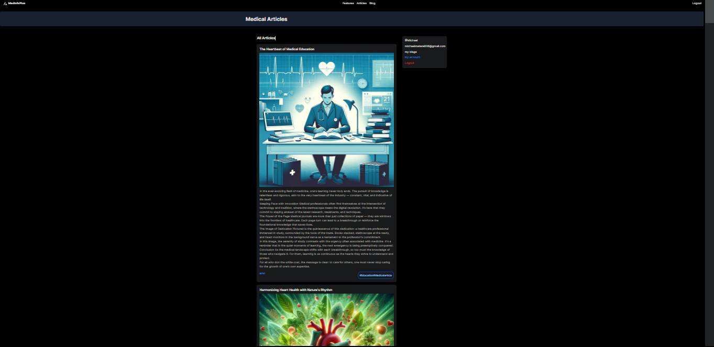
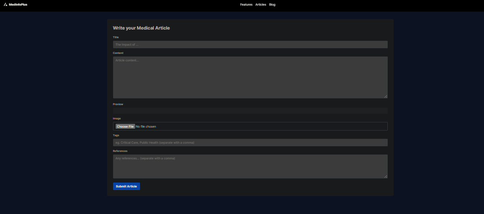

# MedInfoPlus

Welcome to MedInfoPlus, a groundbreaking project where the synergy of medical expertise and technological innovation transforms the landscape of accessing and comprehending medical information. Our interdisciplinary team, consisting of dedicated Medical and Software engineers, shares a common vision: to revolutionize the way individuals engage with healthcare knowledge.



## Project Overview

At MedInfoPlus, we understand the intricate nature of medical information. As medical engineers, we have firsthand experience with the complexities of healthcare knowledge. Simultaneously, as software engineers, we recognize the immense potential of technology to bridge the gap and offer accurate, user-friendly medical articles.

## Mission

Our mission is to empower individuals to make informed healthcare choices by providing them with reliable, accessible, and easily understandable medical information. We believe that by combining medical insights with technological innovation, we can create a platform that revolutionizes the way people access and comprehend healthcare content.

# Key Features

* Accurate Information: 
MedInfoPlus ensures the delivery of precise and up-to-date medical information through collaboration with experienced medical professionals.

* User-Friendly Interface: 

Our user interface is designed to be intuitive and accessible, making it easy for individuals with varying levels of medical knowledge to navigate and understand.



This is a [Next.js](https://nextjs.org/) project bootstrapped with [`create-next-app`](https://github.com/vercel/next.js/tree/canary/packages/create-next-app).

## Getting Started

First, run the development server:

```bash
npm run dev
# or
yarn dev
# or
pnpm dev
# or
bun dev
```

Open [http://localhost:3000](http://localhost:3000) with your browser to see the result.

You can start editing the page by modifying `app/page.tsx`. The page auto-updates as you edit the file.

This project uses [`next/font`](https://nextjs.org/docs/basic-features/font-optimization) to automatically optimize and load Inter, a custom Google Font.

## Learn More

To learn more about Next.js, take a look at the following resources:

- [Next.js Documentation](https://nextjs.org/docs) - learn about Next.js features and API.
- [Learn Next.js](https://nextjs.org/learn) - an interactive Next.js tutorial.

You can check out [the Next.js GitHub repository](https://github.com/vercel/next.js/) - your feedback and contributions are welcome!

## Deploy on Vercel

The easiest way to deploy your Next.js app is to use the [Vercel Platform](https://vercel.com/new?utm_medium=default-template&filter=next.js&utm_source=create-next-app&utm_campaign=create-next-app-readme) from the creators of Next.js.

Check out our [Next.js deployment documentation](https://nextjs.org/docs/deployment) for more details.

## Contact Us

Have questions, feedback, or suggestions? Reach out to us at [michaelmatere606@gmail.com](Michael Gichamu), [wachiraamos402@gmail.com](Amos Wachira)